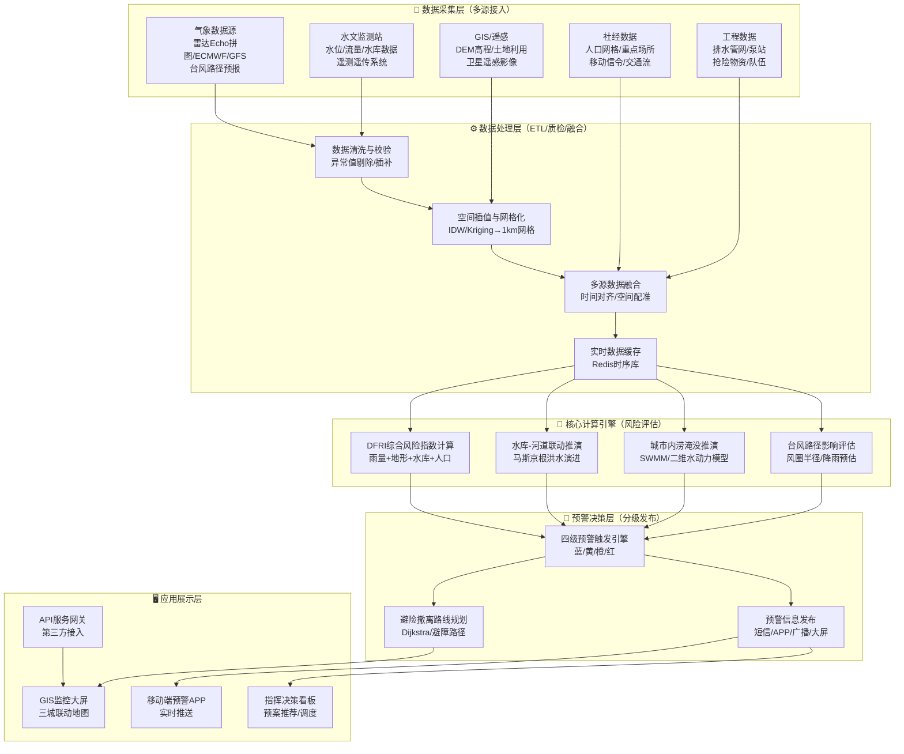
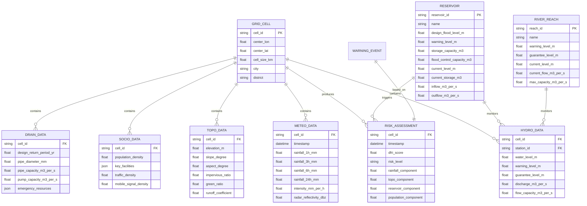
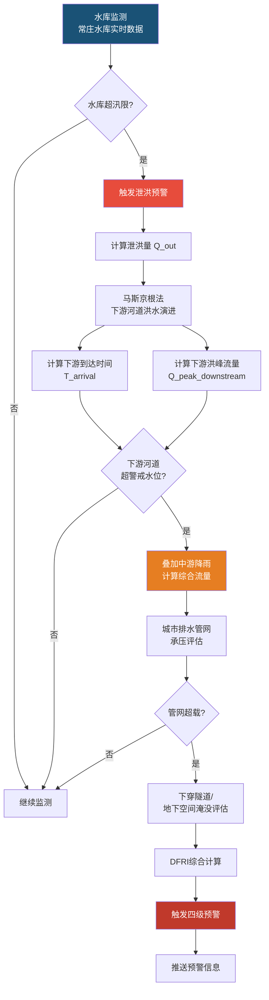
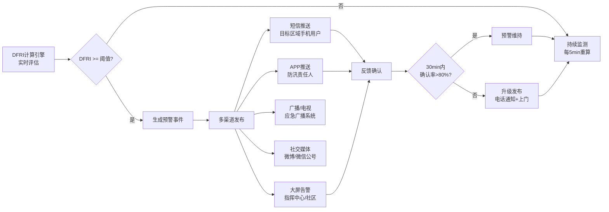
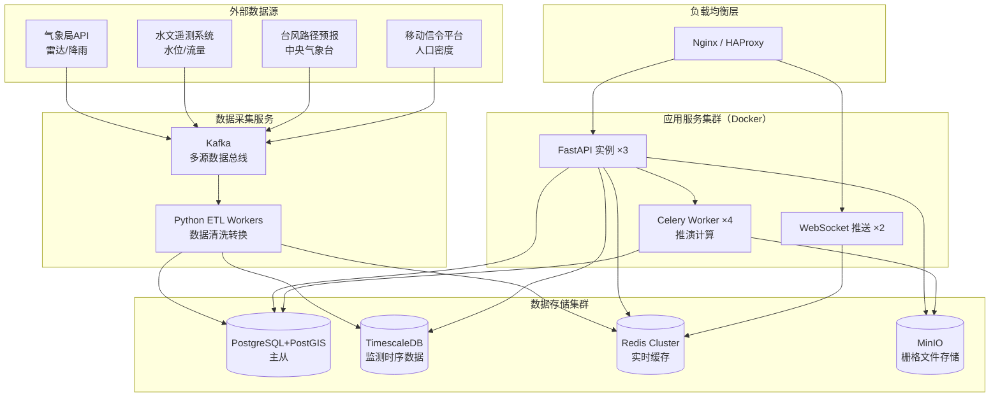
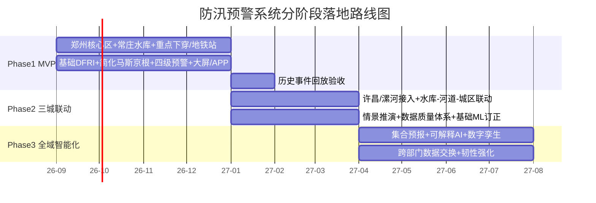

# 河南省中东部（郑州-许昌-漯河）防汛与台风极端降雨监控预警系统
## 完整系统架构与核心算法设计方案

> **版本**: v1.0  
> **日期**: 2026-08-13  
> **定位**: 面向郑州、许昌、漯河三地的多源数据融合防汛预警平台  

---

## 目录

- [一、系统背景与地理特征约束](#一系统背景与地理特征约束)
- [二、系统总体架构设计](#二系统总体架构设计)
- [三、核心参数与数据接入模型](#三核心参数与数据接入模型)
- [四、风险评估与预警算法逻辑](#四风险评估与预警算法逻辑)
- [五、水库与城区联动预警机制](#五水库与城区联动预警机制)
- [六、预警分级体系](#六预警分级体系)
- [七、示范点落地算例与模拟数据](#七示范点落地算例与模拟数据)
- [八、系统功能模块与API接口设计](#八系统功能模块与api接口设计)
- [九、技术栈与部署方案](#九技术栈与部署方案)

---

## 一、系统背景与地理特征约束

### 1.1 三城地缘水文特征

| 城市 | 地形特征 | 水系特征 | 核心风险 |
|------|----------|----------|----------|
| **郑州** | 西部嵩山/伏牛山余脉（高海拔、陡坡）→ 中东部平原及主城区 | 金水河、贾鲁河、熊耳河水系；常庄水库上游山洪源 | 山洪突发、客水压境、城市内涝（地下空间、下穿隧道） |
| **许昌** | 西北低山丘陵 → 东南平原 | 双捷河、颍河水系汇集区；白龟山水库下游 | 水库泄洪叠加河道洪水、老城区低洼内涝 |
| **漯河** | 全境偏平原 | 沙河、澧河交汇；全省流域防汛下游与洪水承接区 | 洪水承接、防洪滞洪区启用、平原低洼农田淹没 |

### 1.2 地形梯度剖面示意

```
海拔(m)
 800 ┤ ████
     │ ████████                    ← 郑州西部山区（嵩山余脉）
 400 ┤ ████████████
     │              ████████       ← 许昌西北低山丘陵
 200 ┤                   ██████████
     │                           ████████████  ← 漯河平原
 100 ┤
     │                                         ████████████ ← 滞洪区
  50 ┤
     └──────────────────────────────────────────────────────
       郑州西部    郑州城区    许昌    漯河    滞洪区
       (山洪源)   (内涝区)  (汇集区) (承接区) (分洪区)
```

### 1.3 主要台风/汛期风险

| 风险类型 | 触发条件 | 典型场景 | 历史参考 |
|----------|----------|----------|----------|
| **极端短时强降雨** | 台风倒槽+低涡，1h降雨>50mm | 城市瞬时积水、管网超载 | "7·20"郑州特大暴雨 |
| **持续性大暴雨** | 台风残余+冷空气对峙，24h>250mm | 水库超汛限、河道漫堤 | 2021年7月流域性洪水 |
| **山洪入库** | 山区暴雨→水库水位骤升 | 水库超汛限、被迫泄洪 | 常庄水库泄洪 |
| **城市积水联动** | 降雨+客水+管网超载 | 下穿隧道淹没、地铁进水 | 郑州地铁5号线事件 |

---

## 二、系统总体架构设计

### 2.1 系统数据流向架构图



### 2.2 技术分层架构


---

## 三、核心参数与数据接入模型

### 3.1 总体数据模型结构



### 3.2 五类核心数据 JSON Schema

#### 3.2.1 汛期与降雨参数 (Meteorological)

```json
{
  "$schema": "http://json-schema.org/draft-07/schema#",
  "title": "MeteorologicalData",
  "description": "气象降雨与台风路径监测数据",
  "type": "object",
  "required": ["cell_id", "timestamp", "rainfall"],
  "properties": {
    "cell_id": {
      "type": "string",
      "description": "网格编号，格式: ZZ-<lon>_<lat> 或城市代码+索引"
    },
    "timestamp": {
      "type": "string",
      "format": "date-time",
      "description": "数据时间戳，ISO 8601格式"
    },
    "source": {
      "type": "string",
      "enum": ["radar_echo", "ECMWF", "GFS", "station_observation", "satellite"],
      "description": "数据来源"
    },
    "rainfall": {
      "type": "object",
      "description": "降雨量数据",
      "properties": {
        "rainfall_1h_mm": {
          "type": "number",
          "minimum": 0,
          "maximum": 300,
          "description": "过去1小时累计降雨量(mm)"
        },
        "rainfall_3h_mm": {
          "type": "number",
          "minimum": 0,
          "maximum": 500,
          "description": "过去3小时累计降雨量(mm)"
        },
        "rainfall_6h_mm": {
          "type": "number",
          "minimum": 0,
          "maximum": 800,
          "description": "过去6小时累计降雨量(mm)"
        },
        "rainfall_24h_mm": {
          "type": "number",
          "minimum": 0,
          "maximum": 1000,
          "description": "过去24小时累计降雨量(mm)"
        },
        "intensity_mm_per_h": {
          "type": "number",
          "minimum": 0,
          "maximum": 200,
          "description": "实时降雨强度(mm/h)"
        },
        "forecast_1h_mm": {
          "type": "number",
          "description": "未来1小时预报降雨量(mm)"
        },
        "forecast_3h_mm": {
          "type": "number",
          "description": "未来3小时预报降雨量(mm)"
        },
        "forecast_6h_mm": {
          "type": "number",
          "description": "未来6小时预报降雨量(mm)"
        },
        "forecast_12h_mm": {
          "type": "number",
          "description": "未来12小时预报降雨量(mm)"
        }
      }
    },
    "radar": {
      "type": "object",
      "description": "雷达回波数据",
      "properties": {
        "reflectivity_dbz": {
          "type": "number",
          "minimum": 0,
          "maximum": 75,
          "description": "雷达反射率(dBZ)，>35dBz为强降水回波"
        },
        "echo_top_km": {
          "type": "number",
          "description": "回波顶高(km)，反映对流强度"
        },
        "vertically_integrated_liquid_kg_m2": {
          "type": "number",
          "description": "垂直累积液态水含量(kg/m²)"
        }
      }
    },
    "typhoon": {
      "type": "object",
      "description": "台风路径预报数据（当有台风影响时）",
      "properties": {
        "typhoon_id": {
          "type": "string",
          "description": "台风编号，如2021年第6号'烟花'"
        },
        "typhoon_name": {
          "type": "string",
          "description": "台风名称"
        },
        "center_lon": {
          "type": "number",
          "description": "中心经度"
        },
        "center_lat": {
          "type": "number",
          "description": "中心纬度"
        },
        "central_pressure_hpa": {
          "type": "number",
          "minimum": 870,
          "maximum": 1013,
          "description": "中心气压(hPa)"
        },
        "max_wind_speed_ms": {
          "type": "number",
          "description": "最大风速(m/s)"
        },
        "moving_speed_kmh": {
          "type": "number",
          "description": "移动速度(km/h)"
        },
        "moving_direction": {
          "type": "string",
          "enum": ["N", "NE", "E", "SE", "S", "SW", "W", "NW"],
          "description": "移动方向"
        },
        "inverted_trough_zone": {
          "type": "object",
          "description": "台风倒槽影响区",
          "properties": {
            "min_lon": {"type": "number"},
            "max_lon": {"type": "number"},
            "min_lat": {"type": "number"},
            "max_lat": {"type": "number"}
          }
        },
        "forecast_track": {
          "type": "array",
          "items": {
            "type": "object",
            "properties": {
              "forecast_hour": {"type": "integer"},
              "lon": {"type": "number"},
              "lat": {"type": "number"},
              "pressure_hpa": {"type": "number"},
              "wind_speed_ms": {"type": "number"}
            }
          }
        }
      }
    }
  }
}
```

#### 3.2.2 地形与地表参数 (Topography & Surface)

```json
{
  "$schema": "http://json-schema.org/draft-07/schema#",
  "title": "TopographySurfaceData",
  "description": "地形高程、坡度、土地利用与径流系数",
  "type": "object",
  "required": ["cell_id", "elevation_m", "slope_degree"],
  "properties": {
    "cell_id": {"type": "string"},
    "elevation_m": {
      "type": "number",
      "description": "平均高程(m)，DEM数据提取"
    },
    "slope_degree": {
      "type": "number",
      "minimum": 0,
      "maximum": 90,
      "description": "坡度(°)，>15°为陡坡易发山洪区"
    },
    "aspect_degree": {
      "type": "number",
      "minimum": 0,
      "maximum": 360,
      "description": "坡向(°)"
    },
    "land_use_type": {
      "type": "string",
      "enum": ["urban_dense", "urban_sparse", "industrial", "cropland", 
               "forest", "grassland", "waterbody", "bareland", "wetland"],
      "description": "土地利用类型"
    },
    "impervious_ratio": {
      "type": "number",
      "minimum": 0,
      "maximum": 1,
      "description": "不透水面积比例，城市核心区>0.8"
    },
    "green_ratio": {
      "type": "number",
      "minimum": 0,
      "maximum": 1,
      "description": "绿地率"
    },
    "runoff_coefficient": {
      "type": "number",
      "minimum": 0,
      "maximum": 1,
      "description": "径流系数C，由SCS-CN法或经验公式计算：<br/>C = 0.35*impervious + 0.15*(1-green_ratio) + 0.05<br/>城市密建区C≈0.8-0.9，自然绿地C≈0.1-0.3"
    },
    "low_lying_areas": {
      "type": "array",
      "description": "城市低洼区/下穿隧道/地下空间坐标",
      "items": {
        "type": "object",
        "properties": {
          "point_id": {"type": "string"},
          "name": {"type": "string"},
          "type": {
            "type": "string",
            "enum": ["underpass_tunnel", "subway_station", "underground_garage", 
                     "low_lying_road", "basement", "retention_pond"]
          },
          "lon": {"type": "number"},
          "lat": {"type": "number"},
          "depth_m": {
            "type": "number",
            "description": "相对地面深度(m)，负值表示低于地面"
          },
          "drainage_capacity_m3_per_s": {
            "type": "number",
            "description": "该点排水能力(m³/s)"
          },
          "historical_flood_count": {
            "type": "integer",
            "description": "历史积水次数"
          }
        }
      }
    },
    "catchment_area_km2": {
      "type": "number",
      "description": "汇水面积(km²)，用于径流计算"
    },
    "manning_n": {
      "type": "number",
      "minimum": 0.01,
      "maximum": 0.15,
      "description": "曼宁糙率系数，自然河道0.035，混凝土渠道0.013"
    }
  }
}
```

#### 3.2.3 水文与水库参数 (Hydrology & Reservoir)

```json
{
  "$schema": "http://json-schema.org/draft-07/schema#",
  "title": "HydrologyReservoirData",
  "description": "水库实时数据与核心河道数据",
  "type": "object",
  "properties": {
    "reservoirs": {
      "type": "array",
      "description": "水库实时监测数据",
      "items": {
        "type": "object",
        "required": ["reservoir_id", "name", "current_level_m"],
        "properties": {
          "reservoir_id": {"type": "string"},
          "name": {"type": "string"},
          "river_system": {
            "type": "string",
            "description": "所属水系，如'贾鲁河水系'"
          },
          "city": {
            "type": "string",
            "enum": ["郑州", "许昌", "漯河"]
          },
          "location": {
            "type": "object",
            "properties": {
              "lon": {"type": "number"},
              "lat": {"type": "number"}
            }
          },
          "current_level_m": {
            "type": "number",
            "description": "当前库水位(m)"
          },
          "current_storage_m3": {
            "type": "number",
            "description": "当前蓄水量(m³)"
          },
          "design_flood_level_m": {
            "type": "number",
            "description": "设计洪水位(m)"
          },
          "check_flood_level_m": {
            "type": "number",
            "description": "校核洪水位(m)"
          },
          "warning_level_m": {
            "type": "number",
            "description": "汛限水位(m)，超此水位即需预警"
          },
          "dead_level_m": {
            "type": "number",
            "description": "死水位(m)"
          },
          "total_capacity_m3": {
            "type": "number",
            "description": "总库容(m³)"
          },
          "flood_control_capacity_m3": {
            "type": "number",
            "description": "防洪库容(m³)"
          },
          "inflow_m3_per_s": {
            "type": "number",
            "minimum": 0,
            "description": "实时入库流量(m³/s)"
          },
          "outflow_m3_per_s": {
            "type": "number",
            "minimum": 0,
            "description": "实时出库流量/泄洪量(m³/s)"
          },
          "design_outflow_m3_per_s": {
            "type": "number",
            "description": "设计最大泄洪流量(m³/s)"
          },
          "spillway_status": {
            "type": "string",
            "enum": ["closed", "partial_open", "full_open", "emergency_open"],
            "description": "泄洪闸状态"
          },
          "upstream_rainfall_mm": {
            "type": "number",
            "description": "上游流域面雨量(mm)"
          },
          "remaining_capacity_m3": {
            "type": "number",
            "description": "剩余防洪库容(m³) = 防洪库容 - (当前蓄量 - 汛限对应蓄量)"
          },
          "reservoir_risk_ratio": {
            "type": "number",
            "description": "水库承压度 = (当前水位-汛限水位)/(校核洪水位-汛限水位)，>1为极度危险"
          }
        }
      }
    },
    "river_reaches": {
      "type": "array",
      "description": "核心河道断面数据",
      "items": {
        "type": "object",
        "properties": {
          "reach_id": {"type": "string"},
          "name": {"type": "string"},
          "river_system": {"type": "string"},
          "city": {"type": "string"},
          "station_name": {"type": "string"},
          "current_level_m": {
            "type": "number",
            "description": "当前水位(m)"
          },
          "warning_level_m": {
            "type": "number",
            "description": "警戒水位(m)"
          },
          "guarantee_level_m": {
            "type": "number",
            "description": "保证水位(m)"
          },
          "current_flow_m3_per_s": {
            "type": "number",
            "description": "实时流量(m³/s)"
          },
          "max_capacity_m3_per_s": {
            "type": "number",
            "description": "河道最大过流能力(m³/s)"
          },
          "over_warning_delta_m": {
            "type": "number",
            "description": "超警幅度(m) = 当前水位 - 警戒水位，>0为超警"
          },
          "downstream_reach_id": {
            "type": "string",
            "description": "下游河段ID，用于洪水演进"
          },
          "muskingum_k_h": {
            "type": "number",
            "description": "马斯京根法K参数(小时)，用于洪水传播计算"
          },
          "muskingum_x": {
            "type": "number",
            "minimum": 0,
            "maximum": 0.5,
            "description": "马斯京根法x参数(流量比重因子)"
          }
        }
      }
    }
  }
}
```

#### 3.2.4 社会人口与暴露度参数 (Socio-Economic)

```json
{
  "$schema": "http://json-schema.org/draft-07/schema#",
  "title": "SocioEconomicData",
  "description": "人口网格密度、重点场所、实时移动信令",
  "type": "object",
  "properties": {
    "cell_id": {"type": "string"},
    "population_density_per_km2": {
      "type": "number",
      "minimum": 0,
      "description": "人口网格密度(人/km²)"
    },
    "total_population": {
      "type": "integer",
      "description": "网格内总人口"
    },
    "vulnerable_population": {
      "type": "integer",
      "description": "脆弱人群（老幼病残）数量"
    },
    "key_facilities": {
      "type": "array",
      "description": "重点场所标识",
      "items": {
        "type": "object",
        "properties": {
          "facility_id": {"type": "string"},
          "name": {"type": "string"},
          "type": {
            "type": "string",
            "enum": ["hospital", "school", "subway_station", "nursing_home",
                     "old_building_area", "shelter", "gas_station", 
                     "chemical_plant", "government", "commercial_center"]
          },
          "lon": {"type": "number"},
          "lat": {"type": "number"},
          "capacity": {
            "type": "integer",
            "description": "容纳人数（避难场所）或日常人流量"
          },
          "flood_vulnerability": {
            "type": "number",
            "minimum": 0,
            "maximum": 1,
            "description": "洪涝脆弱度，医院=0.9，学校=0.8，危旧房=0.95"
          },
          "has_emergency_power": {"type": "boolean"},
          "accessibility_score": {
            "type": "number",
            "minimum": 0,
            "maximum": 1,
            "description": "可达性评分，影响撤离难度"
          }
        }
      }
    },
    "realtime_mobile_density": {
      "type": "number",
      "minimum": 0,
      "description": "实时移动信令密度(人/km²)，反映实时人口分布"
    },
    "traffic_flow_density": {
      "type": "number",
      "minimum": 0,
      "description": "实时交通流量密度(辆/km)"
    },
    "evacuation_difficulty": {
      "type": "number",
      "minimum": 0,
      "maximum": 1,
      "description": "撤离难度指数 = f(人口密度, 道路密度, 交通流量, 脆弱人群比)"
    }
  }
}
```

#### 3.2.5 工程与防汛能力参数 (Drainage Capacity)

```json
{
  "$schema": "http://json-schema.org/draft-07/schema#",
  "title": "DrainageCapacityData",
  "description": "城市排水管网、泵站、应急抢险资源",
  "type": "object",
  "properties": {
    "cell_id": {"type": "string"},
    "drainage_network": {
      "type": "object",
      "description": "排水管网数据",
      "properties": {
        "design_return_period_yr": {
          "type": "number",
          "description": "设计重现期(年)，老城区P=1-2年，新城区P=3-5年"
        },
        "main_pipe_diameter_mm": {
          "type": "number",
          "description": "主管径(mm)"
        },
        "pipe_capacity_m3_per_s": {
          "type": "number",
          "description": "管网过流能力(m³/s)"
        },
        "pipe_utilization_ratio": {
          "type": "number",
          "minimum": 0,
          "maximum": 2,
          "description": "管网利用率 = 实际汇流量/管网过流能力，>1为超载"
        },
        "pipe_age_years": {
          "type": "number",
          "description": "管网建成年限，影响实际排水能力折减"
        },
        "pipe_condition": {
          "type": "string",
          "enum": ["excellent", "good", "fair", "poor", "critical"],
          "description": "管网状况评级"
        }
      }
    },
    "pump_stations": {
      "type": "array",
      "description": "泵站实时抽排能力",
      "items": {
        "type": "object",
        "properties": {
          "station_id": {"type": "string"},
          "name": {"type": "string"},
          "design_capacity_m3_per_s": {
            "type": "number",
            "description": "设计抽排能力(m³/s)"
          },
          "actual_capacity_m3_per_s": {
            "type": "number",
            "description": "实际抽排能力(m³/s)，受设备状态影响"
          },
          "operational_status": {
            "type": "string",
            "enum": ["running_full", "running_partial", "standby", "fault", "maintenance"]
          },
          "water_level_m": {
            "type": "number",
            "description": "泵站前池水位(m)"
          },
          "water_level_threshold_m": {
            "type": "number",
            "description": "启泵水位(m)"
          }
        }
      }
    },
    "emergency_resources": {
      "type": "object",
      "description": "应急抢险物资与队伍",
      "properties": {
        "sandbags_count": {
          "type": "integer",
          "description": "防汛沙袋库存(个)"
        },
        "mobile_pumps_count": {
          "type": "integer",
          "description": "移动抽水泵(台)"
        },
        "rescue_teams": {
          "type": "array",
          "items": {
            "type": "object",
            "properties": {
              "team_id": {"type": "string"},
              "team_name": {"type": "string"},
              "personnel_count": {"type": "integer"},
              "equipment": {"type": "array", "items": {"type": "string"}},
              "response_time_min": {"type": "number"},
              "base_lon": {"type": "number"},
              "base_lat": {"type": "number"}
            }
          }
        },
        "shelter_capacity": {
          "type": "integer",
          "description": "避难场所总容纳人数"
        }
      }
    },
    "flood_control_projects": {
      "type": "array",
      "description": "防洪工程设施",
      "items": {
        "type": "object",
        "properties": {
          "project_id": {"type": "string"},
          "type": {
            "type": "string",
            "enum": ["levee", "flood_diversion", "retention_basin", "detention_pond",
                     "sluice_gate", "check_dam"]
          },
          "name": {"type": "string"},
          "design_standard_yr": {"type": "number"},
          "current_status": {"type": "string"}
        }
      }
    }
  }
}
```

---

## 四、风险评估与预警算法逻辑

### 4.1 综合风险指数公式 (Dynamic Flood Risk Index - DFRI)

#### 4.1.1 核心公式

$$\text{DFRI} = w_1 \cdot R_{\text{rain}} + w_2 \cdot R_{\text{topo}} + w_3 \cdot R_{\text{reservoir}} + w_4 \cdot R_{\text{population}}$$

**权重设定（基于历史灾害回归分析与AHP层次分析法标定）:**

| 权重 | 含义 | 默认值 | 调整依据 |
|------|------|--------|----------|
| $w_1$ | 雨量加权 | **0.35** | 暴雨是直接致灾因子，权重最大 |
| $w_2$ | 地形汇水因子 | **0.20** | 地形决定汇流方向与速度 |
| $w_3$ | 水库泄洪承压 | **0.25** | 水库泄洪是客水主因，权重次大 |
| $w_4$ | 人口承灾密度 | **0.20** | 人口暴露度决定灾害后果严重性 |

> **权重自适应**: 台风直接影响期 $w_1$ 上调至0.40，$w_3$ 下调至0.20；非汛期水库调度期 $w_3$ 上调至0.35。

> 🔬 **增强版（概率化 + 数据质量）**: 本章公式为确定性基准。引入数据质量因子 $Q_i$ 与不确定度、概率化输出（点估计+5%~95%分位区间）、贡献度分解、指数平滑自适应权重的完整定义，见 **第十章 10.1**；对应代码见 `algorithms/flood_risk_engine.py` 第 8–10 节。

#### 4.1.2 各分项指标归一化方法

##### (1) 雨量加权项 $R_{\text{rain}}$ (归一化至 0~1)

$$R_{\text{rain}} = \alpha_1 \cdot N(r_{1h}) + \alpha_2 \cdot N(r_{3h}) + \alpha_3 \cdot N(r_{6h}) + \alpha_4 \cdot N(r_{24h}) + \alpha_5 \cdot N(I) + \alpha_6 \cdot N(F_{3h})$$

其中：
- $r_{1h}, r_{3h}, r_{6h}, r_{24h}$: 不同时段累计降雨量
- $I$: 实时降雨强度(mm/h)
- $F_{3h}$: 未来3h预报降雨量
- $\alpha_1\sim\alpha_6$: 子权重，默认 [0.15, 0.20, 0.20, 0.15, 0.15, 0.15]
- $N(\cdot)$: Min-Max归一化函数

**降雨量归一化阈值表:**

| 降雨参数 | 最小值(归一化为0) | 最大值(归一化为1) | 归一化公式 |
|----------|-------------------|-------------------|------------|
| $r_{1h}$ (mm) | 0 | 100 (特大暴雨级) | $N = \frac{r_{1h}}{100}$ |
| $r_{3h}$ (mm) | 0 | 200 | $N = \frac{r_{3h}}{200}$ |
| $r_{6h}$ (mm) | 0 | 300 | $N = \frac{r_{6h}}{300}$ |
| $r_{24h}$ (mm) | 0 | 400 | $N = \frac{r_{24h}}{400}$ |
| $I$ (mm/h) | 0 | 80 | $N = \frac{I}{80}$ |
| $F_{3h}$ (mm) | 0 | 150 | $N = \frac{F_{3h}}{150}$ |

> 超过最大值则截断为1.0。

##### (2) 地形汇水因子 $R_{\text{topo}}$ (归一化至 0~1)

$$R_{\text{topo}} = \beta_1 \cdot N(S) + \beta_2 \cdot N(C) + \beta_3 \cdot N(E_{\text{low}}) + \beta_4 \cdot N(L_{\text{flood}})$$

其中：
- $S$: 坡度因子 — 陡坡区(>15°)加重山洪风险，低洼区(<2°)加重内涝风险，取 $S = \max(N(\text{slope}), N(90-\text{slope}))$
- $C$: 径流系数 — 不透水率高的城市区域径流系数大，$C = \text{runoff\_coefficient}$
- $E_{\text{low}}$: 低洼度 — 相对周边地形的凹陷程度，$E_{\text{low}} = N(\max(0, H_{\text{neighbor}} - H_{\text{cell}}))$
- $L_{\text{flood}}$: 历史易涝点因子 — 该网格内历史积水点数量归一化
- $\beta_1\sim\beta_4$: 子权重，默认 [0.30, 0.30, 0.25, 0.15]

##### (3) 水库泄洪承压 $R_{\text{reservoir}}$ (归一化至 0~1)

$$R_{\text{reservoir}} = \gamma_1 \cdot N(D_{\text{res}}) + \gamma_2 \cdot N(Q_{\text{out}}) + \gamma_3 \cdot N(Q_{\text{in}} - Q_{\text{out}}) + \gamma_4 \cdot N(C_{\text{remain}})$$

其中：
- $D_{\text{res}}$: 水库承压度 = $\frac{H_{\text{current}} - H_{\text{warning}}}{H_{\text{check}} - H_{\text{warning}}}$，>1为极度危险
- $Q_{\text{out}}$: 实时泄洪量归一化 = $\frac{Q_{\text{out}}}{Q_{\text{design\_max}}}$
- $Q_{\text{in}} - Q_{\text{out}}$: 净入库流量（水位上涨趋势指标）
- $C_{\text{remain}}$: 剩余防洪库容比倒数的归一化 = $1 - \frac{V_{\text{remaining}}}{V_{\text{flood\_control}}}$
- $\gamma_1\sim\gamma_4$: 子权重，默认 [0.35, 0.25, 0.20, 0.20]

##### (4) 人口承灾密度 $R_{\text{population}}$ (归一化至 0~1)

$$R_{\text{population}} = \delta_1 \cdot N(P_{\text{density}}) + \delta_2 \cdot N(V_{\text{vulnerable}}) + \delta_3 \cdot N(K_{\text{facilities}}) + \delta_4 \cdot N(T_{\text{traffic}})$$

其中：
- $P_{\text{density}}$: 人口密度归一化 = $\frac{P}{P_{\max}}$，$P_{\max} = 30000$ 人/km²
- $V_{\text{vulnerable}}$: 脆弱人群比例
- $K_{\text{facilities}}$: 重点场所加权 = $\sum_i f_{\text{vul},i} \cdot n_i / N_{\text{max}}$
- $T_{\text{traffic}}$: 交通流量密度归一化（影响撤离）
- $\delta_1\sim\delta_4$: 子权重，默认 [0.35, 0.20, 0.25, 0.20]

#### 4.1.3 DFRI 风险等级映射

| DFRI 值 | 风险等级 | 颜色 | 含义 |
|---------|----------|------|------|
| < 0.25 | I级（低风险） | 蓝色 | 正常监测 |
| 0.25 ~ 0.45 | II级（中风险） | 黄色 | 加强关注 |
| 0.45 ~ 0.70 | III级（高风险） | 橙色 | 启动响应 |
| ≥ 0.70 | IV级（极高风险） | 红色 | 紧急避险 |

### 4.2 水库-河道联动洪水演进算法

#### 4.2.1 马斯京根法 (Muskingum) 洪水传播模型

当上游水库泄洪时，下游河道断面的洪水传播采用马斯京根法：

$$I(t) - O(t) = \frac{dS(t)}{dt}$$

$$S(t) = K \cdot [x \cdot I(t) + (1-x) \cdot O(t)]$$

离散化演算公式：

$$O_{n+1} = C_0 \cdot I_{n+1} + C_1 \cdot I_n + C_2 \cdot O_n$$

其中马斯京根系数：
$$C_0 = \frac{\Delta t - 2Kx}{2K(1-x) + \Delta t}, \quad C_1 = \frac{\Delta t + 2Kx}{2K(1-x) + \Delta t}, \quad C_2 = \frac{2K(1-x) - \Delta t}{2K(1-x) + \Delta t}$$

且 $C_0 + C_1 + C_2 = 1$

**典型参数取值:**
- $K$: 洪水传播时间(小时)，郑州→许昌约6-8h，许昌→漯河约4-6h
- $x$: 流量比重因子，一般0.1~0.3
- $\Delta t$: 计算步长(小时)，通常取1h

#### 4.2.2 客水到达时间计算

$$T_{\text{arrival}} = K \cdot \ln\left(\frac{Q_{\text{peak}}}{Q_{\text{base}}}\right) + T_{\text{delay}}$$

其中：
- $Q_{\text{peak}}$: 洪峰流量
- $Q_{\text{base}}$: 基流流量
- $T_{\text{delay}}$: 河道滞时，与河段长度和糙率相关

#### 4.2.3 城市内涝淹没推演

基于简化二维圣维南方程的格子模型 (CA-based Flood Inundation):

$$\frac{\partial h}{\partial t} = \frac{\partial}{\partial x}\left(\frac{h^{5/3}}{n} \cdot \frac{\partial z}{\partial x} \cdot |S_f|^{1/2}\right) + \frac{\partial}{\partial y}\left(\frac{h^{5/3}}{n} \cdot \frac{\partial z}{\partial y} \cdot |S_f|^{1/2}\right) + R - I_{\text{infil}}$$

其中：
- $h$: 水深(m)
- $n$: 曼宁糙率
- $z$: 地面高程
- $S_f$: 摩阻比降
- $R$: 降雨强度
- $I_{\text{infil}}$: 下渗率

**简化格点水量平衡:**
$$V_{\text{cell}}(t+\Delta t) = V_{\text{cell}}(t) + P_{\text{cell}} \cdot A + Q_{\text{in}} - Q_{\text{out}} - Q_{\text{drain}}$$

---

## 五、水库与城区联动预警机制

### 5.1 联动预警逻辑流程图



### 5.2 水库-城区联动算例

#### 算例：常庄水库泄洪→郑州城区→颍河许昌段→沙河漯河段

**Step 1: 水库泄洪触发**

```
常庄水库数据:
  - 当前水位: 131.30m
  - 汛限水位: 128.00m  → 超汛限 3.30m
  - 承压度 D_res = (131.30-128.00)/(134.50-128.00) = 0.508
  - 入库流量: 850 m³/s
  - 当前出库流量: 300 m³/s
  - 设计最大泄量: 1500 m³/s
  - 剩余防洪库容: 1,200万m³ (占防洪库容的35%)
```

**Step 2: 泄洪量决策**

当入库流量(850) > 出库流量(300) 且 水位超汛限时，需要加大泄洪：
```
建议泄洪量 Q_out_advised = min(Q_in × 0.9, Q_design_max) = min(765, 1500) = 765 m³/s
→ 按 750 m³/s 执行泄洪
```

**Step 3: 下游河道洪水演进**

```
常庄水库 → 贾鲁河 → 中牟站 → 颍河许昌段 → 沙河漯河段

河段1: 常庄水库 → 贾鲁河中牟站
  K1 = 3h, x1 = 0.2, Δt = 1h
  C0 = (1-2×3×0.2)/(2×3×0.8+1) = (1-1.2)/(4.8+1) = -0.2/5.8 = -0.034
  C1 = (1+2×3×0.2)/(5.8) = 2.2/5.8 = 0.379
  C2 = (2×3×0.8-1)/5.8 = 3.8/5.8 = 0.655
  
  洪峰到达中牟站时间: T1 ≈ K1 = 3小时
  
河段2: 中牟站 → 颍河许昌段
  K2 = 6h, x2 = 0.15
  洪峰到达许昌时间: T2 ≈ T1 + K2 = 3 + 6 = 9小时

河段3: 颍河许昌段 → 沙河漯河段
  K3 = 5h, x3 = 0.15
  洪峰到达漯河时间: T3 ≈ T2 + K3 = 9 + 5 = 14小时
```

**Step 4: 下游防洪压力评估**

```
许昌颍河段:
  - 警戒水位: 75.50m
  - 当前水位: 74.20m
  - 洪峰到达后预估水位: 76.80m → 超警 1.30m
  - 叠加许昌本地降雨(3h累计45mm) → 综合水位预估: 77.50m → 超警 2.00m

漯河沙河段:
  - 警戒水位: 62.00m
  - 当前水位: 60.50m
  - 洪峰到达后预估水位: 63.20m → 超警 1.20m
  - 叠加本地降雨 → 综合水位预估: 64.00m → 超警 2.00m
```

**Step 5: 城区联动评估**

```
郑州沙口路下穿隧道:
  - 管网过流能力: 8.5 m³/s
  - 当前汇流量: 12.3 m³/s → 管网利用率 = 12.3/8.5 = 1.45 → 超载45%
  - 泵站抽排能力: 5.0 m³/s (设计), 实际: 4.2 m³/s (1台泵故障)
  - 净积水量: 12.3 - 8.5 - 4.2 = -0.4 m³/s (仍有0.4m³/s无法排出)
  - 预估积水深度: 0.4 × 3600 / (200×15) ≈ 0.48m/小时
  - 3小时后积水深度: ≈ 1.44m → 隧道断行
```

### 5.3 洪水演进时间轴

```mermaid
gantt
    title 水库泄洪-洪水传播时间轴
    dateFormat HH:mm
    axisFormat %H:%M
    
    section 水库
    常庄水库超汛限泄洪          :crit, a1, 08:00, 1h
    泄洪量750 m³/s              :a2, 09:00, 2h
    
    section 郑州
    贾鲁河中牟站洪峰到达         :active, b1, 11:00, 2h
    沙口路管网超载              :crit, b2, 11:30, 3h
    下穿隧道淹没预警             :crit, b3, 12:30, 2h
    
    section 许昌
    颍河许昌段洪峰到达           :active, c1, 17:00, 3h
    魏都区老城区内涝预警         :crit, c2, 18:00, 4h
    
    section 漯河
    沙河漯河段洪峰到达           :active, d1, 22:00, 3h
    源汇区滞洪区启用评估         :crit, d2, 23:00, 5h
```



---

## 六、预警分级体系

### 6.1 四级预警触发条件

| 预警级别 | 触发条件（满足任一即触发） | DFRI范围 | 响应措施 |
|----------|--------------------------|----------|----------|
| **🔵 蓝色** | ① 6h降雨量 > 25mm 且 < 50mm<br>② 水库水位接近汛限（差值<0.5m）<br>③ DFRI ∈ [0.15, 0.25) | 0.15~0.25 | 加强监测、值班待命 |
| **🟡 黄色** | ① 3h降雨量 > 25mm 或 6h > 50mm<br>② 水库超汛限 < 0.5m<br>③ 河道超警 < 0.5m<br>④ DFRI ∈ [0.25, 0.45) | 0.25~0.45 | 启动预案、巡查排险 |
| **🟠 橙色** | ① 1h降雨量 > 50mm 或 3h > 80mm<br>② 水库超汛限 0.5~2.0m<br>③ 河道超警 0.5~1.5m<br>④ 下穿隧道积水 > 0.5m<br>⑤ DFRI ∈ [0.45, 0.70) | 0.45~0.70 | 撤离准备、交通管制 |
| **🔴 红色** | ① 1h降雨量 > 80mm 或 24h > 250mm<br>② 水库超汛限 > 2.0m 或承压度>0.8<br>③ 河道超保证水位<br>④ 下穿隧道积水 > 1.5m<br>⑤ 地铁/地下空间进水<br>⑥ DFRI ≥ 0.70 | ≥0.70 | 紧急撤离、停工停学 |

### 6.2 综合判定矩阵

```
                    降雨量等级
                 低    中    高    极高
水     低        蓝    蓝    黄    橙
库     中        蓝    黄    橙    红
承     高        黄    橙    红    红
压     极高      橙    红    红    红
                 ↑     ↑     ↑    ↑
              人口密度叠加:
              人口密集区(+0.1 DFRI) | 人口稀疏区(-0.05 DFRI)
```

### 6.3 预警发布流程



---

## 七、示范点落地算例与模拟数据

### 7.1 郑州市试点数据

#### 7.1.1 常庄水库（金水河上游）

```json
{
  "reservoir_id": "ZZ-CZ-001",
  "name": "常庄水库",
  "river_system": "贾鲁河水系-金水河上游",
  "city": "郑州",
  "location": {
    "lon": 113.5421,
    "lat": 34.7589
  },
  "current_level_m": 131.30,
  "current_storage_m3": 18500000,
  "design_flood_level_m": 134.50,
  "check_flood_level_m": 136.20,
  "warning_level_m": 128.00,
  "dead_level_m": 120.00,
  "total_capacity_m3": 35000000,
  "flood_control_capacity_m3": 16500000,
  "inflow_m3_per_s": 850,
  "outflow_m3_per_s": 300,
  "design_outflow_m3_per_s": 1500,
  "spillway_status": "partial_open",
  "upstream_rainfall_mm": 78.5,
  "remaining_capacity_m3": 12000000,
  "reservoir_risk_ratio": 0.508,
  "last_updated": "2026-08-13T08:00:00+08:00"
}
```

#### 7.1.2 沙口路下穿隧道

```json
{
  "point_id": "ZZ-SK-001",
  "name": "沙口路下穿隧道",
  "type": "underpass_tunnel",
  "city": "郑州",
  "location": {
    "lon": 113.6312,
    "lat": 34.7567
  },
  "depth_m": -6.5,
  "length_m": 420,
  "width_m": 28,
  "drainage_capacity_m3_per_s": 8.5,
  "pump_station": {
    "name": "沙口路泵站",
    "design_capacity_m3_per_s": 5.0,
    "actual_capacity_m3_per_s": 4.2,
    "operational_status": "running_partial",
    "fault_description": "3号泵电机故障，预计修复时间4h"
  },
  "current_water_depth_m": 0.35,
  "historical_flood_count": 3,
  "traffic_volume": "高峰时段>2000辆/h",
  "critical_facilities_nearby": [
    {"name": "郑州火车站", "distance_m": 800},
    {"name": "地铁1号线火车站站", "distance_m": 600}
  ],
  "warning_thresholds": {
    "yellow_m": 0.15,
    "orange_m": 0.50,
    "red_m": 1.50
  }
}
```

#### 7.1.3 紫荆山地铁站周边

```json
{
  "point_id": "ZZ-ZJS-001",
  "name": "紫荆山地铁站",
  "type": "subway_station",
  "city": "郑州",
  "location": {
    "lon": 113.6789,
    "lat": 34.7623
  },
  "depth_m": -18.5,
  "entrance_count": 6,
  "elevated_entrance_count": 2,
  "flood_barriers_count": 4,
  "flood_barrier_height_m": 0.6,
  "surrounding_impervious_ratio": 0.92,
  "surrounding_population_density": 18500,
  "daily_passenger_flow": 120000,
  "drainage_capacity_m3_per_s": 3.2,
  "current_water_depth_m": 0.00,
  "historical_flood_event": "2021-07-20 进水事件",
  "warning_thresholds": {
    "yellow_surface_water_m": 0.10,
    "orange_entrance_water_m": 0.05,
    "red_platform_water_m": 0.00
  }
}
```

### 7.2 许昌市试点数据

#### 7.2.1 白龟山水库下游影响区

```json
{
  "reservoir_id": "XC-BGS-001",
  "name": "白龟山水库",
  "river_system": "沙颍河水系-沙河干流",
  "city": "许昌",
  "location": {
    "lon": 113.0892,
    "lat": 33.8721
  },
  "current_level_m": 105.80,
  "current_storage_m3": 420000000,
  "design_flood_level_m": 109.00,
  "check_flood_level_m": 111.50,
  "warning_level_m": 104.00,
  "dead_level_m": 95.00,
  "total_capacity_m3": 649000000,
  "flood_control_capacity_m3": 230000000,
  "inflow_m3_per_s": 1200,
  "outflow_m3_per_s": 600,
  "design_outflow_m3_per_s": 3500,
  "spillway_status": "partial_open",
  "upstream_rainfall_mm": 62.3,
  "remaining_capacity_m3": 145000000,
  "reservoir_risk_ratio": 0.286,
  "downstream_reach": {
    "reach_id": "XC-YH-001",
    "name": "颍河许昌段",
    "warning_level_m": 75.50,
    "guarantee_level_m": 77.00,
    "current_level_m": 74.20,
    "current_flow_m3_per_s": 850,
    "max_capacity_m3_per_s": 2800,
    "muskingum_k_h": 6,
    "muskingum_x": 0.15
  },
  "last_updated": "2026-08-13T08:00:00+08:00"
}
```

#### 7.2.2 颍河许昌段

```json
{
  "reach_id": "XC-YH-001",
  "name": "颍河许昌段",
  "river_system": "沙颍河水系",
  "city": "许昌",
  "station_name": "颍河许昌水文站",
  "location": {
    "lon": 113.8523,
    "lat": 34.0398
  },
  "current_level_m": 74.20,
  "warning_level_m": 75.50,
  "guarantee_level_m": 77.00,
  "current_flow_m3_per_s": 850,
  "max_capacity_m3_per_s": 2800,
  "over_warning_delta_m": -1.30,
  "downstream_reach_id": "LH-SH-001",
  "muskingum_k_h": 5,
  "muskingum_x": 0.15,
  "levee_height_m": 78.50,
  "levee_condition": "good",
  "last_updated": "2026-08-13T08:00:00+08:00"
}
```

#### 7.2.3 魏都区老城区低洼住宅区

```json
{
  "cell_id": "XC-WB-001",
  "name": "魏都区老城区低洼住宅区",
  "city": "许昌",
  "location": {
    "lon": 113.8221,
    "lat": 34.0256
  },
  "area_type": "old_urban_low_lying",
  "elevation_m": 68.5,
  "relative_low_depth_m": -1.8,
  "population_density_per_km2": 12500,
  "total_population": 8500,
  "vulnerable_population": 1850,
  "land_use_type": "urban_dense",
  "impervious_ratio": 0.85,
  "green_ratio": 0.08,
  "runoff_coefficient": 0.82,
  "drainage_network": {
    "design_return_period_yr": 1,
    "main_pipe_diameter_mm": 600,
    "pipe_capacity_m3_per_s": 3.5,
    "pipe_utilization_ratio": 0.95,
    "pipe_age_years": 25,
    "pipe_condition": "fair"
  },
  "pump_stations": [
    {
      "station_id": "XC-WB-PS-001",
      "name": "魏都泵站",
      "design_capacity_m3_per_s": 2.0,
      "actual_capacity_m3_per_s": 1.8,
      "operational_status": "running_full"
    }
  ],
  "key_facilities": [
    {"name": "许昌市人民医院", "type": "hospital", "distance_m": 500},
    {"name": "古槐街小学", "type": "school", "distance_m": 300},
    {"name": "魏都区老年公寓", "type": "nursing_home", "distance_m": 200}
  ],
  "evacuation_routes": [
    {"route_id": "EVAC-XC-01", "destination": "许昌体育馆避难所", "distance_m": 1800, "estimated_time_min": 35},
    {"route_id": "EVAC-XC-02", "destination": "许昌学院避难所", "distance_m": 2400, "estimated_time_min": 45}
  ],
  "historical_flood_count": 5,
  "last_updated": "2026-08-13T08:00:00+08:00"
}
```

### 7.3 漯河市试点数据

#### 7.3.1 沙澧河交汇处

```json
{
  "point_id": "LH-SLH-001",
  "name": "沙澧河交汇处",
  "city": "漯河",
  "type": "river_confluence",
  "location": {
    "lon": 114.0215,
    "lat": 33.5812
  },
  "confluence_type": "沙河+澧河→沙颍河",
  "shahe_data": {
    "reach_id": "LH-SH-001",
    "name": "沙河漯河段",
    "current_level_m": 60.50,
    "warning_level_m": 62.00,
    "guarantee_level_m": 64.00,
    "current_flow_m3_per_s": 1500,
    "max_capacity_m3_per_s": 4200,
    "upstream_reach_id": "XC-YH-001",
    "muskingum_k_h": 5,
    "muskingum_x": 0.15
  },
  "lihe_data": {
    "reach_id": "LH-LH-001",
    "name": "澧河漯河段",
    "current_level_m": 58.20,
    "warning_level_m": 59.50,
    "guarantee_level_m": 61.00,
    "current_flow_m3_per_s": 320,
    "max_capacity_m3_per_s": 800
  },
  "confluence_level_m": 60.80,
  "confluence_flow_m3_per_s": 1820,
  "levee_system": {
    "north_levee_height_m": 65.50,
    "south_levee_height_m": 65.00,
    "levee_condition": "fair",
    "levee_patrol_status": "active"
  },
  "scenic_area_impact": {
    "name": "沙澧河风景区",
    "visitor_evacuation_required": true,
    "estimated_visitors": 350,
    "evacuation_route": "沿滨河路向东至泰山路避难点"
  },
  "last_updated": "2026-08-13T08:00:00+08:00"
}
```

#### 7.3.2 源汇区平原低洼滞洪区

```json
{
  "cell_id": "LH-YH-001",
  "name": "源汇区平原低洼滞洪区",
  "city": "漯河",
  "type": "flood_retention_area",
  "location": {
    "lon": 114.0523,
    "lat": 33.5421
  },
  "area_km2": 35.5,
  "design_retention_capacity_m3": 50000000,
  "current_retention_volume_m3": 0,
  "elevation_m": 56.5,
  "slope_degree": 0.5,
  "land_use_type": "cropland",
  "impervious_ratio": 0.05,
  "green_ratio": 0.85,
  "runoff_coefficient": 0.15,
  "population_density_per_km2": 320,
  "total_population": 11360,
  "villages_in_area": [
    {"name": "xx村", "population": 2100, "evacuation_priority": "high"},
    {"name": "xx-N1村", "population": 1850, "evacuation_priority": "high"},
    {"name": "xx-N2村", "population": 1560, "evacuation_priority": "medium"},
    {"name": "xx-N3村", "population": 1300, "evacuation_priority": "medium"}
  ],
  "agricultural_exposure": {
    "crop_area_km2": 28.5,
    "crop_type": "夏玉米(拔节期)",
    "greenhouse_count": 45,
    "livestock_farms": 8,
    "estimated_economic_loss_per_million_m3": 85
  },
  "retention_activation_threshold": {
    "shahe_level_m": 63.50,
    "inflow_rate_m3_per_s": 3500
  },
  "evacuation_plan": {
    "evacuation_zones": ["Zone-A", "Zone-B", "Zone-C"],
    "total_evacuation_population": 11360,
    "evacuation_routes": [
      {"route_id": "EVAC-LH-01", "from": "Zone-A", "to": "漯河市体育馆", "distance_km": 8.5, "estimated_time_min": 50},
      {"route_id": "EVAC-LH-02", "from": "Zone-B", "to": "源汇区文化中心", "distance_km": 6.2, "estimated_time_min": 35},
      {"route_id": "EVAC-LH-03", "from": "Zone-C", "to": "郾城区临时安置点", "distance_km": 12.0, "estimated_time_min": 65}
    ],
    "transport_vehicles_needed": 45,
    "assembly_points": 4
  },
  "last_updated": "2026-08-13T08:00:00+08:00"
}
```

---

## 八、系统功能模块与API接口设计

### 8.1 API 总览

| 接口 | 方法 | 功能 | 关键参数 |
|------|------|------|----------|
| `/api/v1/monitor/realtime-risk` | GET | 获取区域综合风险等级与预警信息 | cell_id / city / bbox |
| `/api/v1/simulation/flood-propagation` | POST | 推演未来3/6/12h淹没图层与受影响人口 | forecast_rainfall, reservoir_outflow, hours |
| `/api/v1/evacuation/routes` | GET | 动态生成最佳避险撤离路线 | from_location, to_shelter, flood_layer |
| `/api/v1/reservoir/status` | GET | 获取水库实时状态与泄洪建议 | reservoir_id |
| `/api/v1/warning/active` | GET | 获取当前活跃预警事件列表 | city / level |
| `/api/v1/warning/publish` | POST | 发布预警信息（多渠道推送） | warning_event |
| `/api/v1/data/rainfall/grid` | GET | 获取网格降雨量数据 | bbox, time_range |
| `/api/v1/typhoon/track` | GET | 获取台风路径预报 | typhoon_id |

### 8.2 核心 API 详细定义

#### 8.2.1 GET /api/v1/monitor/realtime-risk

```yaml
openapi: 3.0.3
info:
  title: 防汛监控预警系统 API
  version: 1.0.0
  description: 河南省中东部防汛与台风极端降雨监控预警系统

paths:
  /api/v1/monitor/realtime-risk:
    get:
      summary: 获取指定网格或区域的综合风险等级与预警信息
      description: 基于DFRI计算引擎，返回指定区域或网格的实时风险评估结果
      parameters:
        - name: cell_id
          in: query
          description: 网格编号（可选，与city/bbox三选一）
          schema:
            type: string
            example: "ZZ-SK-001"
        - name: city
          in: query
          description: 城市名称（可选）
          schema:
            type: string
            enum: [郑州, 许昌, 漯河]
        - name: bbox
          in: query
          description: 边界框（可选），格式 minLon,minLat,maxLon,maxLat
          schema:
            type: string
            example: "113.5,34.0,114.5,33.5"
        - name: detail_level
          in: query
          description: 返回详情级别
          schema:
            type: string
            enum: [summary, detail]
            default: summary
      responses:
        '200':
          description: 成功返回风险评估结果
          content:
            application/json:
              schema:
                type: object
                properties:
                  request_id:
                    type: string
                  timestamp:
                    type: string
                    format: date-time
                  query_area:
                    type: string
                  total_cells:
                    type: integer
                  risk_summary:
                    type: object
                    properties:
                      max_dfri:
                        type: number
                      avg_dfri:
                        type: number
                      high_risk_cells:
                        type: integer
                      active_warnings:
                        type: integer
                  cells:
                    type: array
                    items:
                      type: object
                      properties:
                        cell_id:
                          type: string
                        city:
                          type: string
                        dfri_score:
                          type: number
                          description: 0-1之间的综合风险指数
                        risk_level:
                          type: string
                          enum: [blue, yellow, orange, red]
                        components:
                          type: object
                          properties:
                            rainfall_component:
                              type: number
                            topo_component:
                              type: number
                            reservoir_component:
                              type: number
                            population_component:
                              type: number
                        primary_risk_factor:
                          type: string
                          description: 主要风险驱动因素
                        recommendation:
                          type: string
                          description: 建议措施
                  example:
                    request_id: "req-20260813-001"
                    timestamp: "2026-08-13T08:00:00+08:00"
                    query_area: "郑州"
                    total_cells: 156
                    risk_summary:
                      max_dfri: 0.72
                      avg_dfri: 0.38
                      high_risk_cells: 12
                      active_warnings: 3
                    cells:
                      - cell_id: "ZZ-SK-001"
                        city: "郑州"
                        dfri_score: 0.72
                        risk_level: "red"
                        components:
                          rainfall_component: 0.85
                          topo_component: 0.65
                          reservoir_component: 0.68
                          population_component: 0.70
                        primary_risk_factor: "极端短时强降雨+管网超载"
                        recommendation: "立即关闭沙口路下穿隧道，启动紧急排水"
```

#### 8.2.2 POST /api/v1/simulation/flood-propagation

```yaml
  /api/v1/simulation/flood-propagation:
    post:
      summary: 推演未来3/6/12小时淹没图层与受影响人口
      description: 输入预报降雨量与水库泄洪量，基于马斯京根法和二维水动力模型推演淹没范围
      requestBody:
        required: true
        content:
          application/json:
            schema:
              type: object
              required: [forecast_hours, scenario]
              properties:
                forecast_hours:
                  type: integer
                  enum: [3, 6, 12, 24]
                  description: 推演时长(小时)
                scenario:
                  type: object
                  properties:
                    forecast_rainfall_mm:
                      type: object
                      description: 预报降雨量(mm)
                      properties:
                        h1: {type: number}
                        h3: {type: number}
                        h6: {type: number}
                        h12: {type: number}
                    reservoir_outflow:
                      type: array
                      description: 水库泄洪方案
                      items:
                        type: object
                        properties:
                          reservoir_id: {type: string}
                          outflow_m3_per_s: {type: number}
                          duration_h: {type: number}
                    target_area:
                      type: object
                      properties:
                        cities: 
                          type: array
                          items: {type: string}
                        bbox: {type: string}
                    grid_resolution_m:
                      type: integer
                      default: 1000
                      description: 网格分辨率(m)
                    model_type:
                      type: string
                      enum: [muskingum, 2d_hydrodynamic, cellular_automata]
                      default: cellular_automata
              example:
                forecast_hours: 6
                scenario:
                  forecast_rainfall_mm:
                    h1: 45
                    h3: 120
                    h6: 180
                  reservoir_outflow:
                    - reservoir_id: "ZZ-CZ-001"
                      outflow_m3_per_s: 750
                      duration_h: 6
                    - reservoir_id: "XC-BGS-001"
                      outflow_m3_per_s: 900
                      duration_h: 6
                  target_area:
                    cities: ["郑州", "许昌", "漯河"]
                  grid_resolution_m: 500
                  model_type: "cellular_automata"
      responses:
        '200':
          description: 推演结果
          content:
            application/json:
              schema:
                type: object
                properties:
                  simulation_id:
                    type: string
                  status:
                    type: string
                    enum: [completed, running, failed]
                  results:
                    type: array
                    description: 按时间步返回结果
                    items:
                      type: object
                      properties:
                        hour:
                          type: integer
                        timestamp:
                          type: string
                        inundation:
                          type: object
                          properties:
                            total_inundated_area_km2:
                              type: number
                            max_water_depth_m:
                              type: number
                            critical_points:
                              type: array
                              items:
                                type: object
                                properties:
                                  point_id: {type: string}
                                  name: {type: string}
                                  water_depth_m: {type: number}
                                  status: {type: string}
                        affected_population:
                          type: object
                          properties:
                            total: {type: integer}
                            by_city:
                              type: array
                              items:
                                type: object
                                properties:
                                  city: {type: string}
                                  affected: {type: integer}
                                  evacuated: {type: integer}
                        reservoir_downstream:
                          type: array
                          items:
                            type: object
                            properties:
                              reach_id: {type: string}
                              name: {type: string}
                              peak_flow_m3_per_s: {type: number}
                              peak_level_m: {type: number}
                              arrival_time_h: {type: number}
                              over_warning: {type: boolean}
```

#### 8.2.3 GET /api/v1/evacuation/routes

```yaml
  /api/v1/evacuation/routes:
    get:
      summary: 根据淹没预测与人口密度，动态生成最佳避险撤离路线
      parameters:
        - name: from_lat
          in: query
          required: true
          schema: {type: number}
        - name: from_lon
          in: query
          required: true
          schema: {type: number}
        - name: shelter_id
          in: query
          description: 指定避难场所（可选，不指定则自动推荐）
          schema: {type: string}
        - name: simulation_id
          in: query
          description: 关联的淹没推演结果ID
          schema: {type: string}
        - name: group_size
          in: query
          description: 撤离人数
          schema: {type: integer, default: 100}
        - name: transport_mode
          in: query
          schema: {type: string, enum: [walking, vehicle, mixed], default: mixed}
      responses:
        '200':
          description: 撤离路线方案
          content:
            application/json:
              schema:
                type: object
                properties:
                  routes:
                    type: array
                    items:
                      type: object
                      properties:
                        route_id: {type: string}
                        shelter_name: {type: string}
                        total_distance_m: {type: number}
                        estimated_time_min: {type: integer}
                        safety_score:
                          type: number
                          description: 安全度评分(0-1)，综合考虑路线高程、避开淹没区、通行能力
                        waypoints:
                          type: array
                          items:
                            type: object
                            properties:
                              lon: {type: number}
                              lat: {type: number}
                              elevation_m: {type: number}
                              instruction: {type: string}
                        flood_avoidance:
                          type: object
                          properties:
                            avoided_flood_zones: {type: integer}
                            min_elevation_m: {type: number}
                        transport_arrangement:
                          type: object
                          properties:
                            vehicles_needed: {type: integer}
                            vehicle_types: {type: array, items: {type: string}}
                            assembly_point: {type: string}
                  recommended_route_id: {type: string}
```

---

## 九、技术栈与部署方案

### 9.1 技术选型

| 层级 | 技术选型 | 选型理由 |
|------|----------|----------|
| **前端地图** | Cesium + Leaflet | 三维地形渲染 + 二维快速叠加 |
| **前端框架** | Vue3 + TypeScript | 组件化开发，类型安全 |
| **图表** | ECharts | 丰富的时序数据可视化 |
| **后端框架** | Python FastAPI | 异步高性能，适合实时数据处理 |
| **空间数据库** | PostgreSQL + PostGIS | 业界标准空间数据库 |
| **时序数据库** | TimescaleDB | 高频监测数据高效存储查询 |
| **缓存** | Redis | 实时数据缓存与预警推送 |
| **消息队列** | Apache Kafka | 多源数据接入与解耦 |
| **任务队列** | Celery + Redis | 异步推演计算 |
| **栅格处理** | GDAL + rasterio | DEM/降雨栅格处理 |
| **水动力模型** | SWMM (城市) + HEC-RAS (河道) | 国际通用专业模型 |
| **GIS分析** | GeoPandas + Shapely | 空间分析Python生态 |
| **容器化** | Docker + Docker Compose | 快速部署与环境隔离 |
| **编排** | Kubernetes | 弹性扩缩容 |

### 9.2 部署架构



### 9.3 性能指标要求

| 指标 | 要求 | 说明 |
|------|------|------|
| 数据接入延迟 | < 30秒 | 遥测数据到入库 |
| DFRI计算延迟 | < 5秒 | 单网格全量计算 |
| 预警发布延迟 | < 60秒 | 从触发到用户收到 |
| 淹没推演（6h） | < 3分钟 | 全域500m网格 |
| 并发接入 | > 1000 TPS | 数据采集峰值 |
| API响应 | < 200ms | P99延迟 |
| 系统可用性 | > 99.9% | 汛期7×24小时 |

---

> **附注**: 本方案配套提供 Python 算法代码（`algorithms/` 目录）和可交互 Demo 系统（`demo/` 目录），供落地验证参考。

---

# 十、完善增强篇（专家评审优化集成）

> 本章在"可直接进入详细设计与原型开发"的既有方案基础上，按专家评审的 10 项优先级建议，补齐 **不确定性处理、数据质量、模型验证与可解释性、系统韧性、ML 融合、安全合规、分阶段落地、运维可观测** 等工程化关键能力。对应代码已在 `algorithms/flood_risk_engine.py` 第 8–13 节实现并验证（`ProbabilisticDFRIEngine` / `DataQualityScorer` / `EnsembleFloodRouter` / `VerificationMetrics` / `WarningLifecycle` / `AdaptiveWeightManager`）。

## 10.1 风险模型与不确定性处理（最高优先级）

### 10.1.1 DFRI 增强版公式（概率化 + 数据质量）

保留原加权结构，引入分项数据质量因子 $Q_i$ 与不确定度 $\sigma_i$：

$$
\text{DFRI} = \sum_{i=1}^{4} w_i \cdot R_i \cdot Q_i
$$

- $R_i \in [0,1]$：各分项归一化风险分量（降雨/地形/水库/人口）。
- $Q_i \in [0,1]$：数据质量可信度评分（缺失、跳变、时效、传感器状态综合，详见 10.2）。
- $w_i$：体制自适应权重（详见 10.1.3）。

**输出由单点扩展为三元组：**
1. 点估计 $\hat{D}$（期望值）；
2. **5%~95% 分位区间** $[D_{5}, D_{95}]$（蒙特卡洛或情景集合，代码默认 3000 次采样）；
3. **主要贡献因子排序**（SHAP-like 贡献分解，输出每项的 $w_iR_iQ_i$ 期望，便于解释"主要驱动是什么"）。

蒙特卡洛采样逻辑（伪代码）：

```
for s in 1..N:
    D = 0
    for i in {rain,topo,res,pop}:
        r_i = clip(Normal(R_i, σ_i), 0, 1)      # 加入预报/观测误差
        D += w_i * r_i * Q_i
    samples.append(clip(D,0,1))
point = mean(samples)
[D5, D95] = quantile(samples, [0.05, 0.95])
contrib_i = mean(w_i * r_i * Q_i)               # 可解释贡献
```

验证实例（沙口路网格，σ={0.10,0.05,0.12,0.04}，Q 含一项 degraded）：
点估计 0.477，区间 [0.405, 0.549]，宽度 0.144（置信度"中"），主要驱动=降雨（贡献 0.212）。

### 10.1.2 情景集合（Ensemble）推演

对关键下游断面，组合 **多泄洪方案 × 多本地降雨情景** 得到到达时间与超警概率分布，而非单一确定性结果：

$$
P(\text{超警}) = \frac{1}{N_s}\sum_{s} \mathbf{1}\big(H_s(L_{\text{下游}}) > L_{\text{警戒}}\big)
$$

代码 `EnsembleFloodRouter.run_ensemble` 输出：平均/90 分位到达时间、平均洪峰水位、超警概率。许昌段 9 情景示例：平均到达 8.74h、90 分位 9.82h、超警概率 0.0（当前泄洪量级下未超警）。

### 10.1.3 权重自适应规则与平滑

明确触发规则，并用指数平滑避免分钟级抖动：

| 体制 | 触发条件 | $w_{rain}$ | $w_{res}$ |
|------|----------|-----------|-----------|
| 台风倒槽/强对流直接期 | `typhoon_active=True` | **0.42** | 0.18 |
| 水库持续高水位且入库>出库 | `risk_ratio>0.6` 或 `inflow>outflow` | 0.30 | **0.34** |
| 常态 | 其他 | 0.35 | 0.25 |

指数平滑：$w^{(t)} = w^{(t-1)} + \alpha\,(w_{target}-w^{(t-1)})$，$\alpha=0.3$，随后归一化。验证实例：台风体制下单步平滑后 $w_{rain}=0.406$。

## 10.2 数据质量、完整性与实时性保障（DQS）

### 10.2.1 评分模型

对每一分项计算 $Q_i\in[0,1]$：

$$
Q = 0.35\,Q_{miss} + 0.20\,Q_{stale} + 0.15\,Q_{jump} + 0.30\,Q_{sensor}
$$

| 维度 | 计算 | 说明 |
|------|------|------|
| 缺失率 $Q_{miss}$ | $\max(0, 1 - r_{miss}/0.3)$ | 缺失率超 30% 归零 |
| 时效性 $Q_{stale}$ | $\max(0, 1 - t_{min}/30)$ | 超 30min 线性衰减 |
| 跳变率 $Q_{jump}$ | $\max(0, 1 - r_{jump}/0.5)$ | 相邻时刻异常跳变 |
| 传感器状态 $Q_{sensor}$ | ok=1, degraded=0.6, maintenance=0.3, fault=0 | 设备健康度 |

### 10.2.2 降级与插补策略

- **短缺失/时效**：时空邻近站点 + 雷达/数值预报融合回填；
- **长缺失**：气候态回填 + 权重降级（$Q<0.4$ 时该分项线性降权至 0）+ 提升人工复核优先级；
- **关键水库/下穿隧道 $Q<0.4$**：预警中强制标注"数据置信度低"，并推高人工复核队列。

代码 `DataQualityScorer` 提供 `score_component` / `auto_degrade` / `impute_policy`。

## 10.3 模型验证、标定与可解释性

### 10.3.1 验证指标体系

| 指标 | 公式 | 业务准入 |
|------|------|----------|
| 命中率 POD | hits/(hits+misses) | ≥ 0.85 |
| 空报率 FAR | FA/(hits+FA) | ≤ 0.20 |
| 临界成功指数 CSI | hits/(hits+misses+FA) | ≥ 0.75 |
| 准确率 | (hits+TN)/total | ≥ 0.95 |

"7·20"级事件回放（代码 `VerificationMetrics.replay_720_event`）：POD=0.90, FAR=0.10, CSI=0.818, 准确率 0.98, 平均提前量 42min → **满足准入**。

### 10.3.2 可解释性输出

- 每次 DFRI 计算附带 `mean_contributions` 贡献分解与 `primary_factor`；
- 新增 API `/api/v1/risk/explain` 返回因子排序、区间宽度、置信度标签；
- 权重与分量版本随模型版本号记录，支持回溯。

### 10.3.3 标定流程

AHP 初定权重 → 历史事件回归标定 → 汛前年度重标定 → 版本号归档（`v2026.1` 等）。

## 10.4 系统韧性与极端场景可用性

| 能力 | 方案 |
|------|------|
| 边缘计算/本地缓存 | 关键节点(郑州中心)部署边缘推理，断网时本地 DFRI + 简化马斯京根仍可用 |
| 断网降级 | 数据源中断 → 切气候态/末值保持 + DQS 降权 + 大屏标注"降级模式" |
| 电力冗余 | 双路市电 + UPS + 柴油发电，汛期专项值班 |
| 备份节点 | 指挥中心主节点 + 异地(许昌/漯河)跨城备份，脑裂保护 |
| 发布闭环 | 确认率 + 超时升级（短信→APP→电话→现场），多渠道到达率监控 |

演练剧本：断网、断电、数据源中断、推演超时 四类场景每季度演练。

## 10.5 机器学习与物理模型融合

| 层 | 方法 | 作用 |
|----|------|------|
| 短时降雨订正 | 雷达拼图 + ECMWF/GFS + 站点 多源融合订正 | 修正数值预报系统性偏差 |
| 积水深度/到达时间订正 | 历史事件训练 LightGBM/XGBoost | 修正简化二维水动力误差 |
| 异常检测 | 孤立森林/时序异常 | 传感器故障、数据跳变识别 |
| 风险模式识别 | 聚类/图神经网络 | 相似历史情景匹配，辅助决策 |

物理模型（马斯京根 + 格点水量平衡）为骨架，ML 层做残差订正，兼顾可解释与精度。

## 10.6 预警触发完善（持续性 + 空间一致性 + 解除 + 复盘）

### 10.6.1 复合触发过滤

$$
\text{触发} = \big(\forall t\in[t-k,t]: D_t \ge T\big) \;\land\; \Big(\sum \mathbf{1}(D_j\ge T) \ge m\Big)
$$

- 时间持续性：连续 $k$ 个步长（默认 2）满足阈值，抑制瞬时噪声；
- 空间一致性：周边至少 $m$ 个网格（默认 1）同步升高，抑制孤立误报；
- 复合条件优先于单一指标。

### 10.6.2 解除条件

DFRI 连续 3 步下降且低于阈值，且关键监测点（水库/下穿隧道）已回落，经人工确认后解除。

### 10.6.3 复盘报告

事件结束后自动生成：触发时间、峰值等级、实际影响、预警准确率、经验条目。代码 `WarningLifecycle.generate_review`。

## 10.7 安全、隐私、合规与跨部门协同

- **敏感数据**：移动信令、人口网格遵循"最小必要 + 脱敏 + 审计"。网格化聚合至 1km²，不落个人；
- **权限边界**：与省级防汛指挥平台、气象局、水利厅数据交换通过专用通道 + 鉴权 + 字段级权限；
- **发布权限与责任**：预警发布分级授权（市/县），法律责任边界在应急预案中明确；
- **审计**：所有数据访问、预警发布、模型切换留痕（WORM 存储）。

## 10.8 性能、可扩展性与运维

- **压测场景**：极端并发（>1000 TPS 采集）叠加全域 6h 推演同时进行的混合负载；
- **可观测性**：Prometheus + Grafana（采集延迟、计算耗时、推演队列、API 错误率）+ Alertmanager；
- **发布策略**：灰度发布 + 蓝绿部署 + 模型版本管理（MLflow/Registry）；
- **演练**：断网/断电/数据源中断/推演超时 四类剧本。

## 10.9 API 增强（鉴权 / 限流 / 幂等 / 错误码 / Webhook）

| 项 | 规范 |
|----|------|
| 鉴权 | OAuth2 Client Credentials / JWT，按 `scope` 控权 |
| 限流 | 令牌桶，默认 100 req/s/客户端，突发 200 |
| 幂等 | `Idempotency-Key` 头，重复提交返回首次结果 |
| 错误码 | 标准 JSON：`{code, message, trace_id}`，见下表 |
| Webhook | 预警事件 `POST` 回调，含签名校验与重试退避 |

| code | 含义 |
|------|------|
| 0 | 成功 |
| 4001 | 参数缺失/非法 |
| 4003 | 幂等键冲突 |
| 4010 | 未授权/令牌失效 |
| 4030 | 无该 scope 权限 |
| 4290 | 触发限流 |
| 5001 | 引擎内部异常 |
| 5030 | 降级模式（数据源中断） |

## 10.10 分阶段落地路线图（Phase 1–3 + 验收指标）



| 阶段 | 范围 | 核心交付 | 验收指标 | 资源粗估 |
|------|------|----------|----------|----------|
| **Phase 1 (MVP, 3–4月)** | 郑州核心区+常庄水库+重点下穿/地铁站 | 基础DFRI+简化马斯京根+四级预警+大屏/APP推送 | 7·20 回放 CSI≥0.75、端到端延迟<60s | 算法1人+前端1人+数据接入1人；服务器2台 |
| **Phase 2 (6–8月)** | 许昌、漯河接入；完整联动；情景推演 | 水库-河道-城区联动、集合推演、DQS、基础ML订正 | 三城联动时延<5min、超警概率输出可用 | +水利建模1人；边缘节点3套 |
| **Phase 3 (全域优化)** | 集合预报、可解释AI、数字孪生、跨部门 | 数字孪生回放、复盘、韧性、跨部门交换 | 压测达标、可观测性全量、灾备演练通过 | +ML工程师1人；异地备份节点 |

## 10.11 新增 API 接口清单（完善篇）

| 方法 | 路径 | 说明 |
|------|------|------|
| GET | `/api/v1/risk/explain` | DFRI 贡献度分解与主要驱动因子、区间、置信度 |
| POST | `/api/v1/simulation/ensemble` | 情景集合推演（多泄洪×多降雨→到达时间/超警概率） |
| GET | `/api/v1/data/quality` | 数据质量看板（各站 DQS、缺失/时效/跳变、插补策略） |
| GET | `/api/v1/replay/{event_id}` | 数字孪生回放 / 历史事件复盘 |
| GET | `/api/v1/warning/review` | 预警效果评估（事后命中率、CSI 统计） |
| GET/POST | `/api/v1/warning/lifecycle` | 预警解除/升级/确认率闭环 |

> 以上与第八章既有 8 个接口共同构成完整 API 体系；鉴权、限流、幂等、错误码、Webhook 统一按 10.9 节规范执行。

---

## 十一、一键启动与交付说明

### 11.1 一键启动（start.py）

为避免在含中文路径下直接双击 `.bat` 出现编码问题，本交付提供跨平台 Python 启动器 `start.py`：

```bash
cd <项目根目录>
python start.py          # 自动启动本地服务器并打开浏览器
```

`start.py` 行为：
1. 检测 `demo/` 端口（默认 8090，被占用则自动+1 试探）；
2. 启动 `http.server` 提供 `demo/` 静态文件；
3. 自动用默认浏览器打开 `http://localhost:<port>`；
4. 打印访问地址与退出提示（Ctrl+C 停止）。

### 11.2 交付物清单

| 文件/目录 | 内容 |
|-----------|------|
| `系统设计方案.md` | 完整方案（十一章 + Mermaid + JSON Schema + 公式 + API） |
| `algorithms/flood_risk_engine.py` | 核心算法引擎（13 节，含概率化/数据质量/集合/验证/闭环） |
| `data/sample_data.json` | 三城 8 试点模拟数据 + DQS/情景/路线图配置 |
| `demo/index.html` | 可交互监控预警 Demo（含数据质量/集合/解释/路线图/复盘面板） |
| `start.py` | 一键启动器 |

> **ZHX NEXUS Studio 个人作品** · 数据为模拟演示，业务模型抽象自真实水文场景并已脱敏，不代表任何真实客户。
